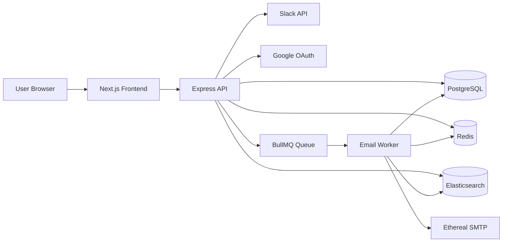

# ReachInbox Email Scheduler

A full-stack email scheduling platform built as a multi-service application for managing bulk outbound email campaigns with OAuth login, Redis-backed rate limiting, BullMQ job processing, PostgreSQL persistence, and Elasticsearch search.

This project is designed to simulate a production-ready outbound email workflow with realistic operational concerns such as retries, idempotency, scheduling, Slack alerts, and dashboard visibility.

## Table of Contents

- [Overview](#overview)
- [Architecture](#architecture)
- [Tech Stack](#tech-stack)
- [Project Structure](#project-structure)
- [Features](#features)
- [Prerequisites](#prerequisites)
- [Quick Start](#quick-start)
- [Environment Variables](#environment-variables)
- [API Reference](#api-reference)
- [Development Workflow](#development-workflow)
- [Assumptions and Trade-offs](#assumptions-and-trade-offs)
- [Troubleshooting](#troubleshooting)

## Overview

ReachInbox Email Scheduler allows authenticated users to:

- schedule a bulk email campaign
- upload recipient lists as CSV or provide JSON recipients
- delay sending between recipients to respect rate limits
- track queued, scheduled, sent, failed, and rate-limited emails
- monitor job execution via BullMQ dashboard
- search email records using Elasticsearch
- receive Slack alerts when sending limits are exceeded
- use Google OAuth for secure login

The application is divided into three main parts:

- Backend API and worker
- Frontend dashboard/UI
- Infrastructure services via Docker Compose

## Architecture



### Request flow

1. User signs in through Google OAuth.
2. User creates a job from the dashboard with recipients and scheduling settings.
3. The backend validates input and stores job metadata in PostgreSQL.
4. The email worker enqueues per-recipient jobs in BullMQ.
5. Redis controls rate limiting and job timing.
6. The worker sends emails through Ethereal SMTP and updates status records.
7. Elasticsearch indexes searchable email records for dashboard search.
8. Slack notifications are emitted when global or per-sender limits are triggered.

## Tech Stack

### Backend

- Node.js 20+
- TypeScript
- Express.js
- Prisma ORM
- PostgreSQL
- Redis
- BullMQ
- Elasticsearch
- Passport.js + Google OAuth
- Slack OAuth + Web API
- Nodemailer
- Zod validation
- Pino logging

### Frontend

- Next.js 15
- React 19
- TypeScript
- Tailwind CSS
- Fetch-based API client

### Infrastructure

- Docker Compose
- PostgreSQL container
- Redis container
- Elasticsearch container

## Project Structure

```text
reachinbox-email-scheduler/
├── backend/
│   ├── prisma/
│   │   ├── schema.prisma
│   │   └── migrations/
│   ├── scripts/
│   │   └── reindex.ts
│   ├── src/
│   │   ├── config/
│   │   ├── controllers/
│   │   ├── middleware/
│   │   ├── queues/
│   │   ├── routes/
│   │   ├── schemas/
│   │   ├── services/
│   │   ├── tests/
│   │   └── index.ts
│   ├── .env.example
│   ├── package.json
│   └── tsconfig.json
├── frontend/
│   ├── src/
│   ├── public/
│   ├── next.config.ts
│   ├── package.json
│   └── tsconfig.json
├── docker-compose.yml
├── REQUIREMENTS.md
├── package.json
├── scripts/
│   └── postgres-init.sql
├── .gitignore
└── README.md
```

## Features

- Google OAuth authentication with session persistence in Redis
- Protected API routes and logout flow
- BullMQ-based email queue with configurable worker concurrency
- Rate limiting with Redis sliding windows
- Rescheduling logic for throttled jobs instead of dropping them
- Per-recipient idempotency checks using unique generated keys
- PostgreSQL data model for jobs, emails, rate limit events, and Slack installations
- Elasticsearch indexing and search for scheduled/sent email records
- BullMQ dashboard at `/admin/queues`
- Email preview support through Ethereal SMTP
- Frontend dashboard for scheduling and monitoring email batches
- Slack OAuth integration for workspace notifications

## Prerequisites

Before running the project, make sure you have:

- Node.js 20+
- npm 10+
- Docker Desktop or Docker Engine
- A Google Cloud project with OAuth credentials
- A Slack app configured for OAuth and bot token access
- Access to local ports:
  - 3000 (frontend)
  - 3001 (backend)
  - 5433 (PostgreSQL)
  - 6379 (Redis)
  - 9200 (Elasticsearch)

## Quick Start

### 1. Install dependencies

From the project root:

```bash
npm install
```

This workspace uses npm workspaces for backend and frontend.

### 2. Start infrastructure services

```bash
docker compose up -d
```

This starts:

- PostgreSQL
- Redis
- Elasticsearch

### 3. Configure the backend environment

Create the backend environment file:

```bash
cp backend/.env.example backend/.env
```

Update the values in `backend/.env` with your actual credentials, especially:

- `DATABASE_URL`
- `SESSION_SECRET`
- `GOOGLE_CLIENT_ID`
- `GOOGLE_CLIENT_SECRET`
- `GOOGLE_CALLBACK_URL`
- `SLACK_CLIENT_ID`
- `SLACK_CLIENT_SECRET`
- `SLACK_SIGNING_SECRET`
- `SLACK_REDIRECT_URI`
- `SLACK_STATE_SECRET`

### 4. Configure the frontend environment

Create a frontend env file if needed:

```bash
cat > frontend/.env.local <<'EOF'
NEXT_PUBLIC_API_URL=http://localhost:3001
EOF
```

### 5. Run Prisma migrations

```bash
cd backend
npx prisma generate
npx prisma migrate dev --name init
```

### 6. Start the app

From the root directory:

```bash
npm run dev
```

This runs both the backend and frontend concurrently.

### 7. Open the app

- Frontend: http://localhost:3000
- Backend API: http://localhost:3001
- BullMQ dashboard: http://localhost:3001/admin/queues
- Health checks: http://localhost:3001/health and http://localhost:3001/health/ready

## Environment Variables

### Backend (`backend/.env`)

| Variable | Required | Default | Description |
| --- | --- | --- | --- |
| `NODE_ENV` | No | `development` | Runtime environment |
| `PORT` | No | `3001` | Backend port |
| `API_BASE_URL` | No | `http://localhost:3001` | Backend base URL |
| `SESSION_SECRET` | Yes | — | Secret for session cookies |
| `SESSION_MAX_AGE_MS` | No | `86400000` | Session lifetime |
| `DATABASE_URL` | Yes | — | PostgreSQL connection string |
| `REDIS_HOST` | No | `localhost` | Redis host |
| `REDIS_PORT` | No | `6379` | Redis port |
| `REDIS_PASSWORD` | No | — | Redis password |
| `REDIS_URL` | No | — | Full Redis URL |
| `ELASTICSEARCH_URL` | No | `http://localhost:9200` | Elasticsearch endpoint |
| `ELASTICSEARCH_INDEX_EMAILS` | No | `emails` | Search index name |
| `GOOGLE_CLIENT_ID` | Yes | — | Google OAuth client ID |
| `GOOGLE_CLIENT_SECRET` | Yes | — | Google OAuth secret |
| `GOOGLE_CALLBACK_URL` | Yes | — | Google OAuth redirect URI |
| `SLACK_CLIENT_ID` | Yes | — | Slack OAuth client ID |
| `SLACK_CLIENT_SECRET` | Yes | — | Slack OAuth secret |
| `SLACK_SIGNING_SECRET` | Yes | — | Slack signing secret |
| `SLACK_REDIRECT_URI` | Yes | — | Slack OAuth redirect URI |
| `SLACK_STATE_SECRET` | Yes | — | CSRF state secret |
| `WORKER_CONCURRENCY` | No | `5` | BullMQ worker concurrency |
| `DEFAULT_DELAY_BETWEEN_EMAILS_MS` | No | `2000` | Delay between sends |
| `DEFAULT_HOURLY_LIMIT` | No | `100` | Default per-job hourly cap |
| `FRONTEND_URL` | No | `http://localhost:3000` | Frontend base URL |
| `CORS_ORIGIN` | No | `http://localhost:3000` | CORS allowlist |

### Frontend (`frontend/.env.local`)

| Variable | Required | Default | Description |
| --- | --- | --- | --- |
| `NEXT_PUBLIC_API_URL` | No | `http://localhost:3001` | Backend API base URL for frontend fetches |

## API Reference

### Health

- `GET /health` — liveness probe
- `GET /health/ready` — readiness check for database, Redis, Elasticsearch, and BullMQ

### Authentication

- `GET /api/auth/google` — initiate Google login
- `GET /api/auth/google/callback` — Google OAuth callback
- `GET /api/auth/me` — authenticated user profile
- `DELETE /api/auth/logout` — logout user
- `GET /api/auth/slack` — start Slack OAuth flow
- `GET /api/auth/slack/callback` — Slack OAuth callback
- `GET /api/auth/slack/status` — Slack workspace status
- `PATCH /api/auth/slack/channel` — set notification channel
- `DELETE /api/auth/slack` — disconnect Slack workspace

### Jobs

- `POST /api/jobs` — create a job
  - accepts JSON recipients or CSV upload
  - supports `subject`, `body`, `senderEmail`, `scheduledAt`, `delayBetweenEmailsMs`, `hourlyLimit`
- `GET /api/jobs` — list user jobs with pagination and status filters
- `GET /api/jobs/:id` — fetch a specific job and related emails
- `DELETE /api/jobs/:id` — cancel a pending or running job
- `POST /api/jobs/simulate` — simulate high-volume enqueueing for testing

### Emails

- `GET /api/emails` — query all user emails
- `GET /api/emails/scheduled` — scheduled emails
- `GET /api/emails/sent` — sent emails
- `GET /api/emails/:id` — get single email details
- `GET /api/emails/search` — direct email search API

### Search

- `GET /api/search?q=...&status=...` — search indexed emails

### Queue Dashboard

- `GET /admin/queues` — BullMQ admin dashboard

## Development Workflow

### Backend commands

```bash
cd backend
npm run dev
npm run build
npm run test
npm run prisma:generate
npm run prisma:migrate
npm run prisma:studio
```

### Frontend commands

```bash
cd frontend
npm run dev
npm run build
npm run lint
```

### Root commands

```bash
npm run dev
npm run build
npm run docker:up
npm run docker:down
npm run docker:reset
```

## Assumptions and Trade-offs

### Assumptions

- The system is intended for local development and demonstration, not a production-grade multi-tenant SaaS deployment.
- Ethereal SMTP is used for safe local email previewing instead of real email delivery.
- OAuth credentials are stored in local environment files during development.
- Elasticsearch is used primarily for search and metadata visibility rather than as the transactional source of truth.

### Trade-offs

- PostgreSQL is used as the authoritative source for job state and email records.
- Rate limiting is implemented with Redis for fast, lightweight state checks.
- BullMQ is used for async processing and delayed retries rather than cron-based scheduling.
- Local Docker infrastructure keeps setup simple and reproducible on common developer machines.
- Search is optimized for local development and demonstration rather than full-scale enterprise indexing patterns.

## Troubleshooting

### Database connection issues

```bash
docker compose up -d
cd backend
npx prisma migrate dev --name init
```

### Redis or queue issues

Check service health:

```bash
curl http://localhost:3001/health/ready
```

### Frontend cannot reach backend

Verify `NEXT_PUBLIC_API_URL` and ensure the backend is running on port 3001.

### Google or Slack OAuth fails

Confirm that:

- redirect URIs match exactly
- environment variables are set in `backend/.env`
- the app is running with the correct `FRONTEND_URL` and `CORS_ORIGIN`

### Elasticsearch index missing

The backend initializes indices on startup, but you can reindex with:

```bash
cd backend
npm run es:reindex
```

## Notes

This README documents the default architecture and developer workflow for this repository. For assignment-specific requirements and checklist tracking, see [REQUIREMENTS.md](REQUIREMENTS.md).


